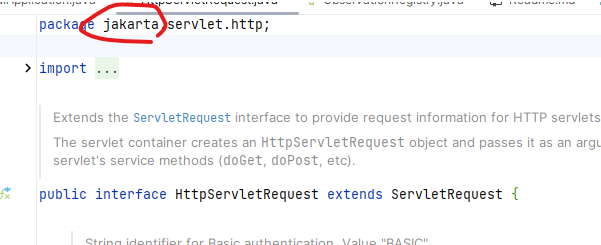

spring cloud
spring boot
spring framework
micrometer.io (metrics, tracing)

# SpringBoot3 학습

## JavaEE에서 JakartaEE로의 전환

Oracle에서 JavaEE 8 까지 지원을 하고 비즈니스 수익이 딸렸는지 Eclipse에게 넘긴 후

Java EE에서 Jakarta EE로의 변경은 자바 엔터프라이즈 커뮤니티에 있어서 상당히 중요한 이벤트였습니다. 이 변화의 배경과 중요한 측면을 이해하기 위해 아래의 내용을 살펴봅시다.

1. 소유권 이전: Java EE는 원래 오라클이 소유하고 있었으나, 커뮤니티와 함께 더 효율적으로 발전시키기 위해 이클립스 재단에 이전되었습니다. 이로 인해 브랜드 이름이 Jakarta EE로 변경되었습니다.

2. 라이선스 변경: Java EE는 여러 제약사항이 있는 라이선스 하에 있었으나, Jakarta EE는 이클립스 재단의 더 개방적인 라이선스 하에 배포되고 있습니다. 이로 인해 개발자와 기업에게 더 유연한 선택권이 생겼습니다.

3. 커뮤니티 주도 개발: Jakarta EE는 커뮤니티의 참여와 협력을 통해 발전되고 있으며, 이는 기술의 미래를 좀 더 민주적으로 형성하는 데 기여합니다.

4. 기술 표준의 지속적 발전: Jakarta EE는 자바 엔터프라이즈 기술의 표준화를 지속적으로 추진하고 있으며, 기존 Java EE 애플리케이션과의 호환성을 최대한 유지하면서 현대적인 클라우드 네이티브 아키텍처를 지원하기 위해 노력하고 있습니다.

5. 법적 문제: 'Java' 브랜드에 대한 사용 권리 문제로 인해, 기술명에서 'Java'라는 단어를 제거해야 했습니다. 이로 인해 기존 라이브러리와 패키지 이름 등에도 변화가 필요했습니다.

결론적으로, Java EE에서 Jakarta EE로의 전환은 단순히 이름 변경 이상의 의미를 가지고 있으며, 자바 엔터프라이즈 개발의 미래에 큰 영향을 미치고 있습니다. 이는 기술의 방향성, 개방성, 커뮤니티 참여 등에 있어 중요한 변화를 가져왔습니다.


* HttpServletRequest가 jakarta로 변경된 모습



## testcontainer

docker로 TestApplciation.java에 testcontainer를 띄워서 실제와 동일하게 테스트가 가능하다.

test하위에 Application.java를 활용,

` @RestartScope` 를 사용하면 재시작시에도 빈 재구축을 하지 않고 기존의 것 그대로 사용한다.

```groovy
    runtimeOnly 'org.postgresql:postgresql'
    testImplementation 'org.springframework.boot:spring-boot-testcontainers'
    testImplementation 'org.testcontainers:postgresql'
```


```java

@TestConfiguration(proxyBeanMethods = false)
public class TestBootifulApplication {

    @Bean
    @RestartScope
    @ServiceConnection
    PostgreSQLContainer<?> postgresContainer() {
        return new PostgreSQLContainer<>(DockerImageName.parse("postgres:latest"));
    }

    public static void main(String[] args) {
        SpringApplication.from(BootifulApplication::main).with(TestBootifulApplication.class).run(args);
    }

}
```


## ProblemDetail

* Assert 문으로 validation 검사 -> IllegalStateException 발생

```java
@GetMapping("/customers/{name}")
    Iterable<Customer> customersByName(@PathVariable String name){
        Assert.state(Character.isUpperCase(name.charAt(0)), "the name must start with a capital letter!");
        return Observation
                .createNotStarted("by-name" , this.registry)
                .observe(() -> this.customerRepositroy.findByName(name));
    }
```

* ExceptionHandler로 예외처리. 정보가 더 다양한 ProblemDetail로 반환

```java

    @ControllerAdvice
    class ErrorHandlingControllerAdvice{

        @ExceptionHandler
        ProblemDetail handle(IllegalStateException ise, HttpServletRequest request) {
            request.getHeaderNames().asIterator()
                    .forEachRemaining(System.out::println);
            var pd = ProblemDetail.forStatus(HttpStatus.BAD_REQUEST.value());
            pd.setDetail(ise.getLocalizedMessage());
            return pd;
        }
    }
```

```json
{"type":"about:blank",
  "title":"Bad Request",
  "status":400,
  "detail":"the name must start with a capital letter!",
  "instance":"/customers/josh"}
```


micrometer로 metrics, tracing모두가 가능해졌다.


## micrometer Observation으로 API actiator 관리

### 1. 추적을 원하는 API에 Observation

```java


    @GetMapping("/customers/{name}")
    Iterable<Customer> customersByName(@PathVariable String name){
        Assert.state(Character.isUpperCase(name.charAt(0)), "the name must start with a capital letter!");
        return Observation
                .createNotStarted("by-name" , this.registry)
                .observe(() -> this.customerRepositroy.findByName(name));
    }
```
    
    
http://localhost:8080/actuator/
```json
// 20230816142845
// http://localhost:8080/actuator

{
  "_links": {
    "self": {
      "href": "http://localhost:8080/actuator",
      "templated": false
    },
    "beans": {
      "href": "http://localhost:8080/actuator/beans",
      "templated": false
    },
    "caches-cache": {
      "href": "http://localhost:8080/actuator/caches/{cache}",
      "templated": true
    },
    "caches": {
      "href": "http://localhost:8080/actuator/caches",
      "templated": false
    },
    "health": {
      "href": "http://localhost:8080/actuator/health",
      "templated": false
    },
    "health-path": {
      "href": "http://localhost:8080/actuator/health/{*path}",
      "templated": true
    },
    "info": {
      "href": "http://localhost:8080/actuator/info",
      "templated": false
    },
    "conditions": {
      "href": "http://localhost:8080/actuator/conditions",
      "templated": false
    },
    "configprops": {
      "href": "http://localhost:8080/actuator/configprops",
      "templated": false
    },
    "configprops-prefix": {
      "href": "http://localhost:8080/actuator/configprops/{prefix}",
      "templated": true
    },
    "env": {
      "href": "http://localhost:8080/actuator/env",
      "templated": false
    },
    "env-toMatch": {
      "href": "http://localhost:8080/actuator/env/{toMatch}",
      "templated": true
    },
    "loggers": {
      "href": "http://localhost:8080/actuator/loggers",
      "templated": false
    },
    "loggers-name": {
      "href": "http://localhost:8080/actuator/loggers/{name}",
      "templated": true
    },
    "heapdump": {
      "href": "http://localhost:8080/actuator/heapdump",
      "templated": false
    },
    "threaddump": {
      "href": "http://localhost:8080/actuator/threaddump",
      "templated": false
    },
    "metrics-requiredMetricName": {
      "href": "http://localhost:8080/actuator/metrics/{requiredMetricName}",
      "templated": true
    },
    "metrics": {
      "href": "http://localhost:8080/actuator/metrics",
      "templated": false
    },
    "scheduledtasks": {
      "href": "http://localhost:8080/actuator/scheduledtasks",
      "templated": false
    },
    "mappings": {
      "href": "http://localhost:8080/actuator/mappings",
      "templated": false
    }
  }
}

```


http://localhost:8080/actuator/metrics

> 위에서 우리가 Observation에 등록한 "by-name"이 리스트에 보이는 것을 확인

```json
// 20230816142905
// http://localhost:8080/actuator/metrics

{
  "names": [
    "application.ready.time",
    "application.started.time",
    "by-name",
    "by-name.active",
    "disk.free",
    "disk.total",
    "executor.active",
    "executor.completed",
    "executor.pool.core",
    "executor.pool.max",
    "executor.pool.size",
    "executor.queue.remaining",
    "executor.queued",
    "hikaricp.connections",
    "hikaricp.connections.acquire",
    "hikaricp.connections.active",
    "hikaricp.connections.creation",
    "hikaricp.connections.idle",
    "hikaricp.connections.max",
    "hikaricp.connections.min",
    "hikaricp.connections.pending",
    "hikaricp.connections.timeout",
    "hikaricp.connections.usage",
    "http.server.requests",
    "http.server.requests.active",
    "jdbc.connections.active",
    "jdbc.connections.idle",
    "jdbc.connections.max",
    "jdbc.connections.min",
    "jvm.buffer.count",
    "jvm.buffer.memory.used",
    "jvm.buffer.total.capacity",
    "jvm.classes.loaded",
    "jvm.classes.unloaded",
    "jvm.compilation.time",
    "jvm.gc.live.data.size",
    "jvm.gc.max.data.size",
    "jvm.gc.memory.allocated",
    "jvm.gc.memory.promoted",
    "jvm.gc.overhead",
    "jvm.gc.pause",
    "jvm.info",
    "jvm.memory.committed",
    "jvm.memory.max",
    "jvm.memory.usage.after.gc",
    "jvm.memory.used",
    "jvm.threads.daemon",
    "jvm.threads.live",
    "jvm.threads.peak",
    "jvm.threads.started",
    "jvm.threads.states",
    "logback.events",
    "process.cpu.usage",
    "process.start.time",
    "process.uptime",
    "spring.data.repository.invocations",
    "system.cpu.count",
    "system.cpu.usage",
    "tomcat.sessions.active.current",
    "tomcat.sessions.active.max",
    "tomcat.sessions.alive.max",
    "tomcat.sessions.created",
    "tomcat.sessions.expired",
    "tomcat.sessions.rejected"
  ]
}

```


http://localhost:8080/actuator/metrics/by-name
```json

// 20230816142756
// http://localhost:8080/actuator/metrics/by-name

{
  "name": "by-name",
  "baseUnit": "seconds",
  "measurements": [
    {
      "statistic": "COUNT",
      "value": 22.0
    },
    {
      "statistic": "TOTAL_TIME",
      "value": 0.099454302
    },
    {
      "statistic": "MAX",
      "value": 0.016671901
    }
  ],
  "availableTags": [
    {
      "tag": "error",
      "values": [
        "none"
      ]
    }
  ]
}

```


## graalvm native support
GraalVM은 GraalVM 네이티브 이미지라는 AOT (ahead-of-time) 컴파일 기술을 제공합니다. 이는 자바 코드를 독립적으로 실행 가능한 네이티브 이미지로 컴파일해주는 기술입니다. GraalVM으로 컴파일된 실행 파일은 응용프로그램과 응용프로그램이 사용하는 라이브러리의 모든 클래스와 Substrate VM이라는 런타임을 내장합니다.

즉, 생성된 실행 파일은 JVM으로 구동하는게 아니라 자체 VM을 내장하고 있어서, 메모리 관리나 스레드 스케줄링 등의 모든 기능을 수행합니다.


GraalVM은 고성능 런타임으로, 여러 언어를 지원하는 JVM(Java Virtual Machine)입니다. GraalVM Native Image는 GraalVM의 특징 중 하나로, 자바 또는 다른 JVM 기반 언어로 작성된 애플리케이션을 미리 컴파일하여 기본 실행 파일로 변환하는 기능을 제공합니다.

이 프로젝트는 경량 컨테이너 또는 네이티브 실행 파일을 생성할 수 있도록 구성되었습니다. 또한 네이티브 이미지에서 테스트를 실행할 수도 있습니다.

GraalVM Native Image의 주요 특징과 이점은 다음과 같습니다:

* 빠른 시작 시간: Native Image는 애플리케이션을 네이티브 코드로 컴파일하므로, JVM이 필요한 클래스를 로드하고 JIT 컴파일을 수행하는 데 필요한 시간이 절약됩니다. 이로 인해 애플리케이션의 시작 시간이 크게 단축됩니다.

* 작은 메모리 사용량: Native Image는 실행에 필요한 코드와 데이터만을 포함하므로, 전통적인 JVM에 비해 메모리 사용량이 줄어듭니다.

* 단독 실행 파일: 결과물은 단독 실행 파일이므로, 별도의 JVM 설치 없이도 실행할 수 있습니다.

* 크로스 언어 최적화: GraalVM은 자바, 코틀린, 스칼라, 그루비 등 여러 JVM 언어와 자바스크립트, LLVM 기반 언어, Python 등을 지원합니다. Native Image를 통해 이러한 다양한 언어로 작성된 코드 간의 최적화를 달성할 수 있습니다.

GraalVM Native Image를 사용하면, 클라우드 환경에서의 미세 서비스, 서버리스 함수, CLI 도구 등과 같이 빠른 시작 시간과 낮은 메모리 사용량이 중요한 시나리오에서 특히 유용할 수 있습니다.

---

1. Cloud Native Buildpacks를 사용한 경량 컨테이너
Spring Boot 컨테이너 이미지 지원에 이미 익숙하다면, 시작하기 가장 쉬운 방법입니다. 이미지를 생성하기 전에 도커가 설치되고 설정되어 있어야 합니다.

이미지를 생성하려면 다음 명령을 실행하세요:
```
$ ./gradlew bootBuildImage
```

그런 다음, 다른 컨테이너와 마찬가지로 앱을 실행할 수 있습니다:

```
$ docker run --rm -p 8080:8080 service:0.0.1-SNAPSHOT
```

2. 네이티브 빌드 도구로 실행 파일 만들기
네이티브 이미지에서 테스트를 실행하는 등 더 많은 옵션을 탐색하려는 경우 이 옵션을 사용하세요. GraalVM native-image 컴파일러가 설치되고 설정되어 있어야 합니다.

참고: GraalVM 22.3+가 필요합니다.

실행 파일을 생성하려면 다음 명령을 실행하세요:


/*
2023-08-16 영어 버전이 아니면

Native-image building on Windows currently only supports target architecture: AMD64 ((x64) unsupported)

에러가 난다.
*/

```
$ ./gradlew nativeCompile
```

그런 다음, 앱을 다음과 같이 실행할 수 있습니다:

```
$ build/native/nativeCompile/service
```

기존 테스트 스위트를 네이티브 이미지에서 실행할 수도 있습니다. 이는 애플리케이션의 호환성을 효율적으로 검증하는 방법입니다.

네이티브 이미지에서 기존 테스트를 실행하려면 다음 명령을 실행하세요:

```
$ ./gradlew nativeTest
```


buildpacks.io